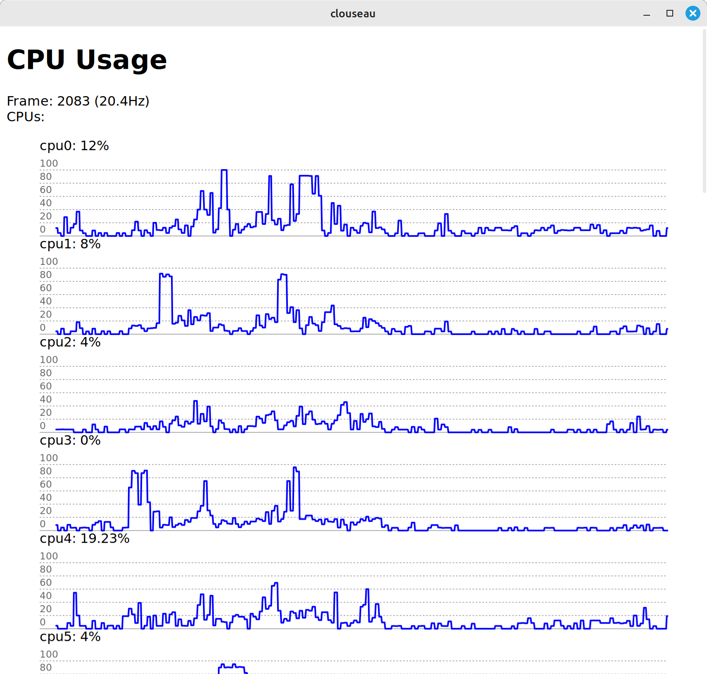

# Clouseau


Clouseau is an proof of concept using [Tauri](https://tauri.app/) with [Sveltekit](https://kit.svelte.dev/), [Layer Cake](https://layercake.graphics/) (charts), and [sysinfo](https://crates.io/crates/sysinfo) to create a simple, cross-platform resource monitor. The primary purpose is to learn about data and resource management in Tauri. 

It's very much a work in progress, but PRs are welcome. 



## Developing

Run `npm install` and `npm run dev` to start the application in development mode. You should see a Tauri app pop up once everything is built.

Note: You can open a browser at `http://localhost:5173/`, but it won't do much, as it's meant to be run with the tauri rust back-end. However, it can be helpful for some debugging.

Note: I have an issue running dev in linux where the stylesheets don't always load. If I make a web request to `localhost:5173` before the tauri app loads it works fine. Seems to be an issue with Tauri/Sveltekit/webkit, but it's possible I have a misconfiguration issue. Works fine in production build and other OSes. 

## Building

To create a production version of your app:

```bash
npm run build
```

## Ideas and Next Steps (PRs Welcome)

- Improve error handling and clean up data types passed between front-end and back-end
- Make unit tests and integration tests actually test something relevant
- Improved styling
- Add CI test & build
- Investigate other methods to decrease performance overhead (eg. OpenGL render, tauri event stream, ssr, etc.)
- Explore typing the data schema between front-end (svelte TS) <> tauri (rust). It feels unfortunate to use a typed front-end and back-end language, but still have a schemaless IPC communication.
- Explore a web back-end. Can the same codebase be built for a server target and also Tauri desktop?
